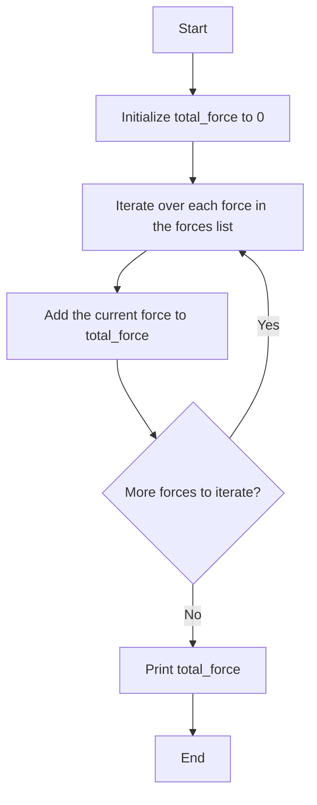

# Introduction to For Loops in Python

In previous sections, we discussed variables, data types, and lists. These concepts are fundamental in programming and are particularly useful in physics for handling data and performing repetitive calculations. Now, we will introduce the concept of the `for` loop, which allows us to iterate over a sequence (such as a list) and perform operations on each element.

## What is a For Loop?

A `for` loop in Python is used to iterate over a sequence (like a list, tuple, dictionary, set, or string) and execute a block of code for each element in the sequence. This is particularly useful in physics when you need to perform the same calculation or operation on multiple data points.

## Syntax of a For Loop

```python
for variable in sequence:
    # Code to execute for each element
```

Here, `variable` takes the value of each element in the `sequence` one by one, and the indented block of code is executed for each value.

## Example: Calculating Kinetic Energy

Let's consider a list of masses and velocities of different objects. We want to calculate the kinetic energy for each object using the formula:

$$ KE = \frac{1}{2}mv^2 \ $$

```python
masses = [2, 5, 10]  # in kilograms
velocities = [3, 4, 5]  # in meters per second

for mass, velocity in zip(masses, velocities):
    kinetic_energy = 0.5 * mass * velocity ** 2
    print(f'Mass: {mass} kg, Velocity: {velocity} m/s, Kinetic Energy: {kinetic_energy} J')
```

In this example, we use the `zip` function to iterate over both `masses` and `velocities` lists simultaneously. The `for` loop calculates the kinetic energy for each pair of mass and velocity and prints the result.

## Example: Summing a List of Forces

Suppose we have a list of forces acting on an object, and we want to calculate the total force.

```python
forces = [10, 15, 20, 25]  # in Newtons

total_force = 0
for force in forces:
    total_force += force

print(f'Total Force: {total_force} N')
## Flowchart for Summing a List of Forces

Below is a flowchart that explains the process of summing a list of forces using a `for` loop:
```



In this flowchart:
- We start by initializing `total_force` to 0.
- We then iterate over each force in the `forces` list.
- For each force, we add it to `total_force`.
- We check if there are more forces to iterate over. If yes, we continue the loop; if no, we print the `total_force` and end the process.

This visual representation helps in understanding the flow of the `for` loop in summing the list of forces.

In this example, the `for` loop iterates over the `forces` list, adding each force to the `total_force` variable.

By understanding and using `for` loops, you can efficiently handle repetitive tasks and data processing in your physics calculations.

## Looping Through an Entire List

In physics, you often need to process entire datasets to extract meaningful information. For example, consider a list of distances traveled by an object at different time intervals. We can use a `for` loop to iterate through the entire list and calculate the total distance traveled.

### Example: Calculating Total Distance

Suppose we have a list of distances traveled by an object at different time intervals. We want to calculate the total distance traveled.

```python
distances = [5, 10, 15, 20]  # in meters

total_distance = 0
for distance in distances:
    total_distance += distance

print(f'Total Distance: {total_distance} meters')
```

In this example, the `for` loop iterates over the `distances` list, adding each distance to the `total_distance` variable. This allows us to calculate the total distance traveled by the object.

By looping through an entire list, you can perform operations on each element and aggregate results, which is a common requirement in physics data analysis.

## Understanding Indentation in Python

Indentation is crucial in Python as it defines the scope of loops, functions, classes, and other control structures. Unlike many other programming languages that use braces `{}` to delimit blocks of code, Python uses indentation levels to determine the grouping of statements.

### Indentation in For Loops

In the context of a `for` loop, the indented block of code under the `for` statement is executed for each element in the sequence. The indentation level must be consistent within the block. Here is an example:

```python
for variable in sequence:
    # Indented block of code
    print(variable)
    # More indented code
    # This code is part of the loop
# This code is outside the loop
```

In this example, the `print(variable)` statement and any other indented lines are executed for each element in the `sequence`. Once the loop completes, the code that is not indented (or is indented less) will execute.

### Common Errors and Solutions

Here is a table of common errors students might encounter when working with `for` loops and their possible solutions:

| Error | Description | Solution |
|-------|-------------|----------|
| **IndentationError** | Inconsistent indentation levels within the loop block. | Ensure all lines within the loop block have the same level of indentation. |
| **SyntaxError** | Missing colon `:` at the end of the `for` statement. | Add a colon `:` at the end of the `for` statement. |
| **NameError** | Using a variable that is not defined within the loop. | Ensure the variable is defined before using it in the loop. |
| **TypeError** | Iterating over a non-iterable object. | Ensure the object being iterated over is a sequence (list, tuple, string, etc.). |
| **IndexError** | Accessing an index that is out of range within the loop. | Ensure the loop does not exceed the bounds of the sequence. |
| **LogicError** | Incorrect logic within the loop, leading to unexpected results. | Carefully review the logic and ensure it performs the intended operations. |

By understanding and avoiding these common errors, students can write more robust and error-free `for` loops in Python.

## Using `range()` Function in For Loops

The `range()` function is often used in `for` loops to generate a sequence of numbers. This is particularly useful when you need to iterate a specific number of times or over a range of values.

### Example: Calculating Potential Energy at Different Heights

Consider an object of mass `m` that is raised to different heights `h`. We want to calculate the potential energy at each height using the formula:

\[ PE = mgh \]

where `g` is the acceleration due to gravity (approximately 9.8 m/s²).

```python
mass = 5  # in kilograms
heights = range(1, 6)  # heights from 1 to 5 meters
g = 9.8  # acceleration due to gravity in m/s²

for height in heights:
    potential_energy = mass * g * height
    print(f'Height: {height} m, Potential Energy: {potential_energy} J')
```

In this example, the `range(1, 6)` function generates a sequence of numbers from 1 to 5. The `for` loop iterates over these heights, calculating and printing the potential energy for each height.

## Working with Slicing of Lists Using For Loops

Slicing allows you to access a subset of elements from a list. This can be useful when you need to process only a part of the data.

### Example: Analyzing a Subset of Data

Suppose we have a list of temperatures recorded over a week, and we want to analyze the temperatures for the first three days.

```python
temperatures = [22, 24, 19, 23, 25, 20, 21]  # temperatures in degrees Celsius

# Slicing the list to get temperatures for the first three days
first_three_days = temperatures[:3]

for temp in first_three_days:
    print(f'Temperature: {temp} °C')
```

In this example, `temperatures[:3]` slices the list to get the temperatures for the first three days. The `for` loop then iterates over this subset, printing each temperature.

By using the `range()` function and list slicing, you can efficiently control the scope of your iterations and focus on specific parts of your data, which is essential in physics data analysis.


> *In our Pythonia land, there was a brilliant physicist named Dr. Loop. He had a magical machine called the "For Loopinator 3000". 
> This machine could perform repetitive tasks with ease, much to the delight of the townsfolk. One day, the king of Pythonia asked 
> Dr. Loop to calculate the kinetic energy of his royal fleet of carriages. Each carriage had a different mass and velocity, and the 
> king wanted to know the kinetic energy of each one.*

> *Dr. Loop, with a twinkle in his eye, fired up the For Loopinator 3000. He fed it a list of masses and velocities, and the machine whirred
> to life. As it iterated over each pair of mass and velocity, it calculated the kinetic energy and displayed it on a magical screen. The > townsfolk gathered around, amazed at how quickly and accurately the For Loopinator 3000 worked.*

> *"Behold the power of the for loop!" Dr. Loop proclaimed. "With this magical construct, we can iterate over sequences and perform calculations with ease. No longer shall we be burdened by repetitive tasks!"*

> *The king was so impressed that he declared a holiday in honor of Dr. Loop and his For Loopinator 3000. From that day forward, the people of Pythonia land used for loops to solve all sorts of problems, from calculating forces to summing distances. And they all lived happily ever after, iterating through their data with joy and efficiency.*

