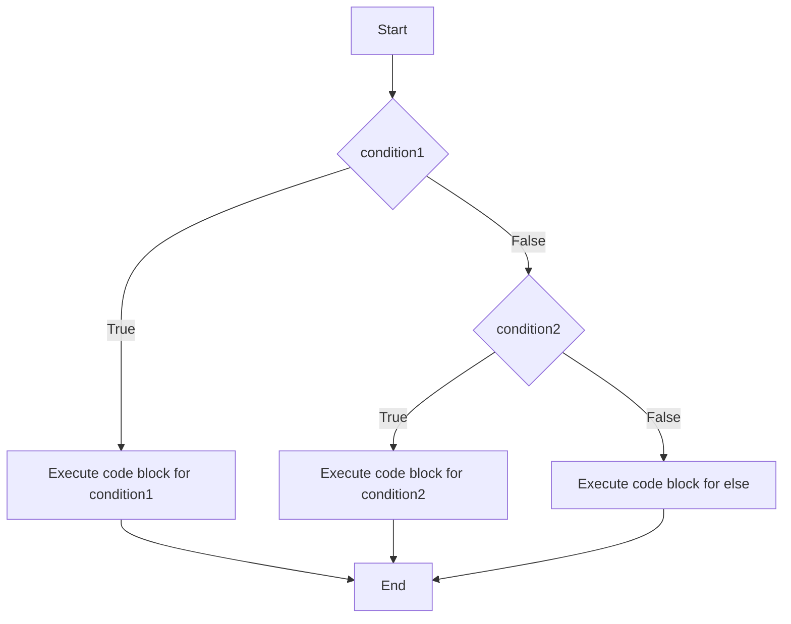

# Introduction to Conditional Statements in Python

In this section, we will explore conditional statements in Python, which allow us to execute certain pieces of code based on specific conditions. This is a crucial concept in programming, as it enables us to control the flow of our programs and make decisions within our code.

## Conditional Statements

### `if` Statement
The `if` statement is used to test a condition. If the condition evaluates to `True`, the code block under the `if` statement is executed. Otherwise, it is skipped.

```python
if condition:
    # code block to execute if condition is True
```

### `else` Statement
The `else` statement can be used in conjunction with the `if` statement to execute a code block if the condition is `False`.

```python
if condition:
    # code block to execute if condition is True
else:
    # code block to execute if condition is False
```

### `elif` Statement
The `elif` (short for "else if") statement allows us to check multiple conditions.

```python
if condition1:
    # code block to execute if condition1 is True
elif condition2:
    # code block to execute if condition1 is False and condition2 is True
else:
    # code block to execute if both condition1 and condition2 are False
```

### `while` Loop
The `while` loop allows us to execute a block of code repeatedly as long as a condition is `True`.

```python
while condition:
    # code block to execute while condition is True
```

## Connecting with Previous Concepts

### Variables
We can use variables to store the conditions we want to test in our `if` and `while` statements.

```python
temperature = 25
if temperature > 20:
    print("It's warm outside.")
```
### Flowchart for Conditional Statements

Below is a flowchart that explains the flow of the `if`, `elif`, and `else` statements:



This flowchart demonstrates how the program evaluates each condition in sequence and executes the corresponding code block based on whether the conditions are `True` or `False`.

### Lists and Tuples
We can use conditional statements to iterate over lists and tuples and perform actions based on their elements.

```python
numbers = [1, 2, 3, 4, 5]
for number in numbers:
    if number % 2 == 0:
        print(f"{number} is even.")
```

### Sets and Dictionaries
Conditional statements can also be used to check for the presence of elements in sets and dictionaries.

```python
fruits = {"apple", "banana", "cherry"}
if "apple" in fruits:
    print("Apple is in the set.")

student_grades = {"Alice": 85, "Bob": 90}
if "Alice" in student_grades:
    print(f"Alice's grade is {student_grades['Alice']}.")
```

By understanding and utilizing conditional statements, you will be able to create more dynamic and responsive programs. This will build on your knowledge of variables, lists, tuples, sets, and dictionaries, allowing you to write more complex and efficient code.