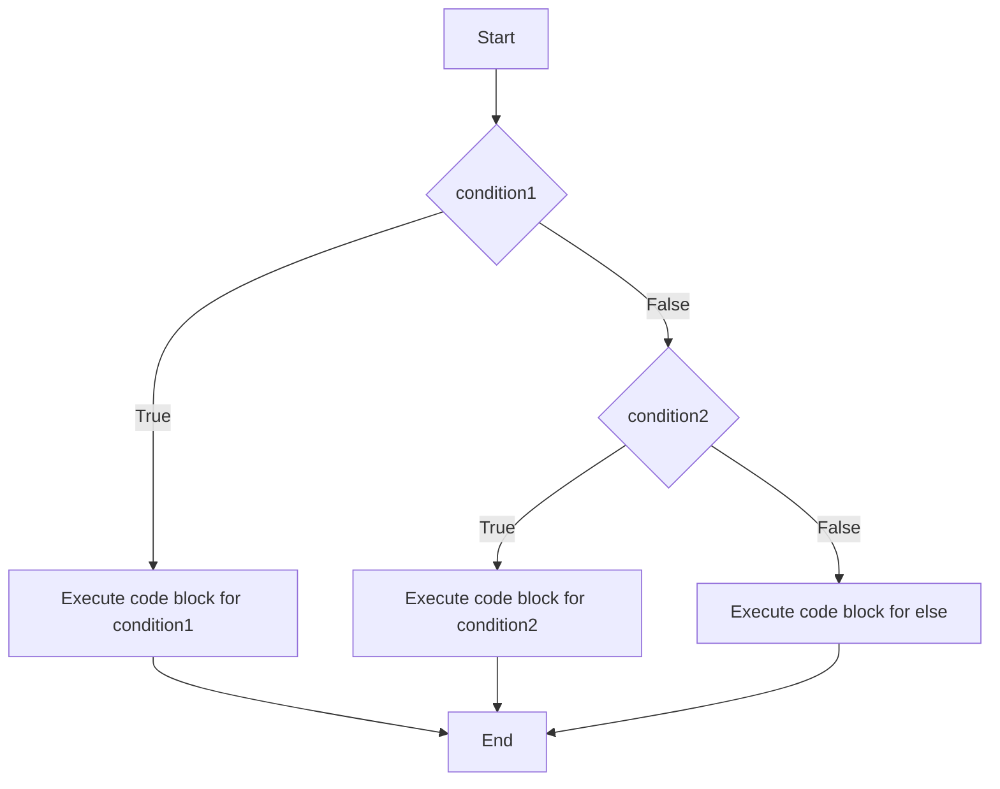
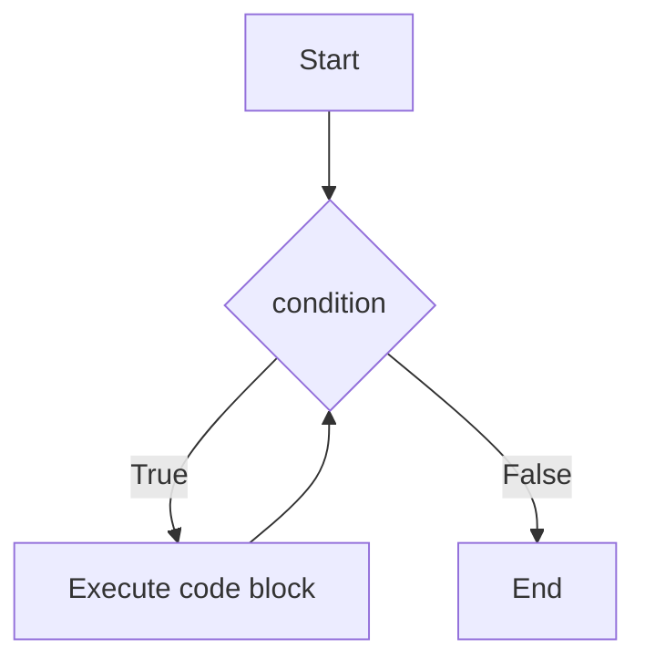
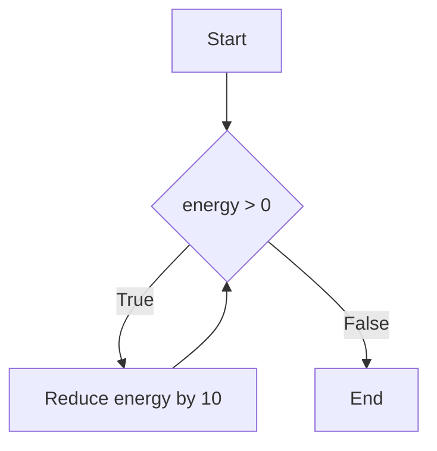
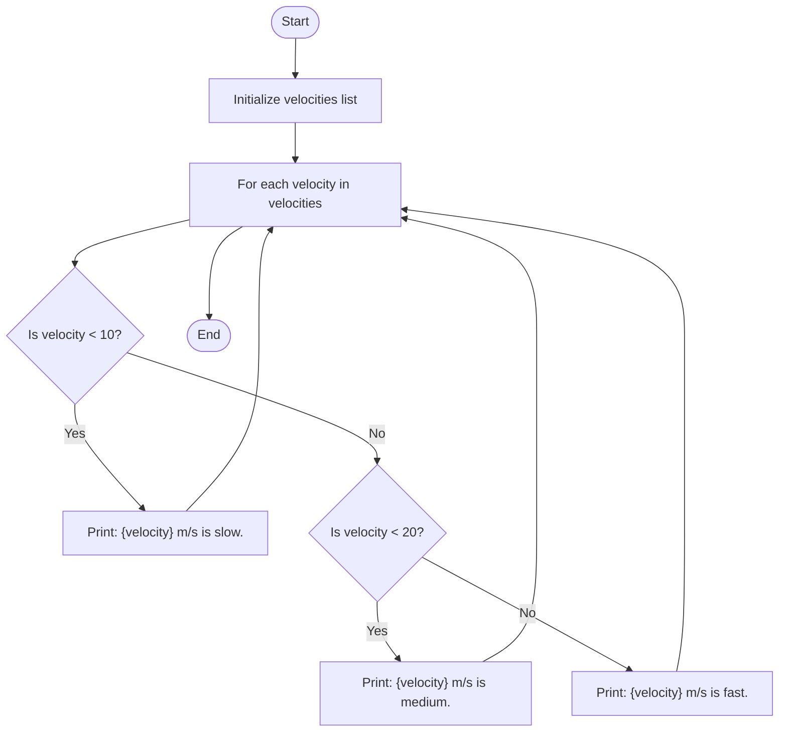
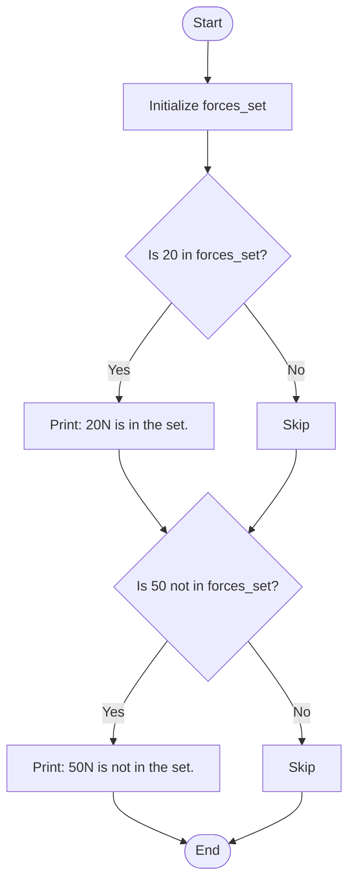

# Introduction to Conditional Statements in Python

In this section, we will explore conditional statements in Python, which allow us to execute certain pieces of code based on specific conditions. This is a crucial concept in programming, as it enables us to control the flow of our programs and make decisions within our code.

## Conditional Statements
### `if` Statement
The `if` statement is used to test a condition. If the condition evaluates to `True`, the code block under the `if` statement is executed. Otherwise, it is skipped.

```python
if condition:
    # code block to execute if condition is True
```

### `else` Statement
The `else` statement can be used in conjunction with the `if` statement to execute a code block if the condition is `False`.

```python
if condition:
    # code block to execute if condition is True
else:
    # code block to execute if condition is False
```

### `elif` Statement
The `elif` (short for "else if") statement allows us to check multiple conditions.

```python
if condition1:
    # code block to execute if condition1 is True
elif condition2:
    # code block to execute if condition1 is False and condition2 is True
else:
    # code block to execute if both condition1 and condition2 are False
```

### `while` Loop
The `while` loop allows us to execute a block of code repeatedly as long as a condition is `True`.

```python
while condition:
    # code block to execute while condition is True
```
### Flowchart for Conditional Statements

Below is a flowchart that explains the flow of the `if`, `elif`, and `else` statements:



This flowchart demonstrates how the program evaluates each condition in sequence and executes the corresponding code block based on whether the conditions are `True` or `False`.

## Flowchart for `while` Loop

Below is a flowchart that explains the flow of the `while` loop:



This flowchart demonstrates how the program repeatedly executes the code block as long as the condition is `True`. Once the condition evaluates to `False`, the loop terminates, and the program proceeds to the next part of the code.

## Connecting with Previous Concepts

### Variables
We can use variables to store the conditions we want to test in our `if` and `while` statements.

```python
temperature = 25
if temperature > 20:
    print("It's warm outside.")
```

### Lists and Tuples
We can use conditional statements to iterate over lists and tuples and perform actions based on their elements.

```python
numbers = [1, 2, 3, 4, 5]
for number in numbers:
    if number % 2 == 0:
        print(f"{number} is even.")
```

### Sets and Dictionaries
Conditional statements can also be used to check for the presence of elements in sets and dictionaries.

```python
fruits = {"apple", "banana", "cherry"}
if "apple" in fruits:
    print("Apple is in the set.")

student_grades = {"Alice": 85, "Bob": 90}
if "Alice" in student_grades:
    print(f"Alice's grade is {student_grades['Alice']}.")
```

By understanding and utilizing conditional statements, you will be able to create more dynamic and responsive programs. This will build on your knowledge of variables, lists, tuples, sets, and dictionaries, allowing you to write more complex and efficient code.

### Physics Examples

Let's apply conditional statements to some physics-related examples.

#### Example 1: Checking Velocity

```python
velocity = 30  # in meters per second
if velocity > 20:
    print("The object is moving fast.")
else:
    print("The object is moving slow.")
```

#### Example 2: Determining Energy State

```python
energy = 50  # in joules
if energy > 100:
    print("High energy state.")
elif energy > 50:
    print("Medium energy state.")
else:
    print("Low energy state.")
```

#### Example 3: Looping Through Forces

```python
forces = [10, 20, 30, 40]  # in newtons
for force in forces:
    if force > 25:
        print(f"{force}N is a strong force.")
    else:
        print(f"{force}N is a weak force.")
```


### Flowchart for `while` Loop

Below is a flowchart that explains the flow of a `while` loop in the context of reducing energy:



This flowchart demonstrates how the program repeatedly reduces the energy value as long as the condition is `True`. Once the condition evaluates to `False`, the loop terminates, and the program proceeds to the next part of the code.
 

> Once upon a time in the land of Codeville, there was a young programmer named Alex. Alex was on a quest to master the art of Python programming. One day, Alex's mentor, the wise Sage Pythonista, decided it was time for Alex to learn about conditional statements. "Alex," said Pythonista, "conditional statements are like crossroads in your code. They help you decide which path to take based on certain conditions." Pythonista began with the `if` statement. "Imagine you are walking through a forest," Pythonista explained. "You come across a fork in the road. If the path on the left is clear, you take it."

```python
path_is_clear = True
if path_is_clear:
    print("You take the left path.")
```


>"But what if the left path is blocked?" asked Alex. "That's where the `else` statement comes in," replied Pythonista. "If the left path is blocked, you take the right path."

```python
path_is_clear = False
if path_is_clear:
    print("You take the left path.")
else:
    print("You take the right path.")
```


>Pythonista continued, "Sometimes, there are more than two paths. That's when you use the `elif` statement. Imagine there are three paths: left, middle, and right."

```python
path = "middle"
if path == "left":
    print("You take the left path.")
elif path == "middle":
    print("You take the middle path.")
else:
    print("You take the right path.")
```


>"Now, let's talk about loops," said Pythonista. "Imagine you are collecting berries in the forest. You keep collecting berries until your basket is full. This is like a `while` loop."

```python
basket_full = False
berries_collected = 0
while not basket_full:
    berries_collected += 1
    if berries_collected >= 10:
        basket_full = True
print("Your basket is full with", berries_collected, "berries.")
```


>With these lessons, Alex felt more confident in navigating the world of Python programming. "Thank you, Sage Pythonista," said Alex. "I now understand how to use conditional statements to control the flow of my code." And so, Alex continued on the journey, using the power of conditional statements to solve problems and create amazing programs. 

By understanding this story, you can see how conditional statements help you make decisions in your code, just like Alex did on the adventure. 

## Mathematical Operations for Conditional Tests

In Python, you can use various mathematical operations to perform conditional tests. Below is a table that explains each operation along with an example:

| Operation | Description                           | Example                                      |
|-----------|---------------------------------------|----------------------------------------------|
| `==`      | Equal to                              | `if a == b: print("a is equal to b")`        |
| `!=`      | Not equal to                          | `if a != b: print("a is not equal to b")`    |
| `>`       | Greater than                          | `if a > b: print("a is greater than b")`     |
| `<`       | Less than                             | `if a < b: print("a is less than b")`        |
| `>=`      | Greater than or equal to              | `if a >= b: print("a is greater or equal to b")` |
| `<=`      | Less than or equal to                 | `if a <= b: print("a is less or equal to b")` |

These operations allow you to compare values and make decisions based on the results of those comparisons. Here are some examples:

```python
a = 10
b = 20

# Equal to
if a == b:
    print("a is equal to b")
else:
    print("a is not equal to b")

# Not equal to
if a != b:
    print("a is not equal to b")

# Greater than
if a > b:
    print("a is greater than b")
else:
    print("a is not greater than b")

# Less than
if a < b:
    print("a is less than b")

# Greater than or equal to
if a >= b:
    print("a is greater than or equal to b")

# Less than or equal to
if a <= b:
    print("a is less than or equal to b")
```

By using these mathematical operations, you can perform a wide range of conditional tests in your Python programs.

### Physics Problem Examples with Solutions

#### Example 1: Calculating Kinetic Energy

Let's calculate the kinetic energy of an object given its mass and velocity. The formula for kinetic energy is:
$$
KE = \frac{1}{2} m v^2 
$$

```python
mass = 10  # in kilograms
velocity = 15  # in meters per second

kinetic_energy = 0.5 * mass * velocity ** 2
print(f"The kinetic energy of the object is {kinetic_energy} joules.")
```

#### Example 2: Classifying Objects Based on Velocity

We will classify objects as "slow", "medium", or "fast" based on their velocities using `if`, `elif`, and `else` statements.

```python
velocities = [5, 15, 25, 35]  # in meters per second

for velocity in velocities:
    if velocity < 10:
        print(f"{velocity} m/s is slow.")
    elif velocity < 20:
        print(f"{velocity} m/s is medium.")
    else:
        print(f"{velocity} m/s is fast.")
```

Flowchart for classifying objects based on velocity:




#### Example 3: Calculating Average Force

We will calculate the average force exerted on an object over a period of time using a list of force values.

```python
forces = [10, 20, 30, 40]  # in newtons
total_force = sum(forces)
number_of_forces = len(forces)
average_force = total_force / number_of_forces
print(f"The average force is {average_force} newtons.")
```


#### Example 4: Checking for Specific Forces in a Set

We will check if certain forces are present in a set of forces using `if` statements.

```python
forces_set = {10, 20, 30, 40}  # in newtons

if 20 in forces_set:
    print("20N is in the set.")
if 50 not in forces_set:
    print("50N is not in the set.")
```

Flowchart for checking specific forces in a set:



By using these examples, you can see how conditional statements and loops can be applied to solve various physics problems. These examples also demonstrate the use of lists, dictionaries, tuples, and sets in conjunction with conditional statements.

## Frequently Asked Questions

### 1. What is the purpose of an `if` statement in Python?
The `if` statement is used to test a condition. If the condition evaluates to `True`, the code block under the `if` statement is executed. Otherwise, it is skipped.

### 2. How does the `else` statement work in Python?
The `else` statement is used in conjunction with the `if` statement to execute a code block if the condition in the `if` statement is `False`.

### 3. What is the difference between `elif` and `else`?
The `elif` (short for "else if") statement allows you to check multiple conditions. If the condition in the `if` statement is `False`, the program checks the `elif` condition. The `else` statement is executed only if all preceding conditions are `False`.

### 4. Can you use multiple `elif` statements in a single conditional block?
Yes, you can use multiple `elif` statements to check multiple conditions in a single conditional block.

### 5. What is a `while` loop and how does it work?
A `while` loop allows you to execute a block of code repeatedly as long as a condition is `True`. The loop terminates when the condition evaluates to `False`.

### 6. How do you use variables in conditional statements?
You can use variables to store the conditions you want to test in your `if` and `while` statements. For example:
```python
temperature = 25
if temperature > 20:
    print("It's warm outside.")
```

### 7. How can you use conditional statements with lists and tuples?
You can use conditional statements to iterate over lists and tuples and perform actions based on their elements. For example:
```python
numbers = [1, 2, 3, 4, 5]
for number in numbers:
    if number % 2 == 0:
        print(f"{number} is even.")
```

### 8. How do you check for the presence of elements in sets and dictionaries using conditional statements?
You can use `if` statements to check for the presence of elements in sets and dictionaries. For example:
```python
fruits = {"apple", "banana", "cherry"}
if "apple" in fruits:
    print("Apple is in the set.")
```

### 9. What are some common mathematical operations used in conditional tests?
Common mathematical operations used in conditional tests include `==` (equal to), `!=` (not equal to), `>` (greater than), `<` (less than), `>=` (greater than or equal to), and `<=` (less than or equal to).

### 10. How can conditional statements be applied to solve physics problems?
Conditional statements can be used to classify objects, calculate values, and check conditions in physics problems. For example, classifying objects based on velocity:
```python
velocities = [5, 15, 25, 35]
for velocity in velocities:
    if velocity < 10:
        print(f"{velocity} m/s is slow.")
    elif velocity < 20:
        print(f"{velocity} m/s is medium.")
    else:
        print(f"{velocity} m/s is fast.")
```

## Common Errors in Conditional Statements

When working with conditional statements like `if`, `elif`, `else`, and `while`, students may encounter various errors. Below is a table listing some common errors along with their descriptions and examples:

| Error Type                | Description                                                                 | Example                                                                 |
|---------------------------|-----------------------------------------------------------------------------|-------------------------------------------------------------------------|
| SyntaxError               | Occurs when there is a syntax mistake in the code.                          | `if x > 10 print("x is greater than 10")` (missing colon)               |
| IndentationError          | Occurs when the code block is not properly indented.                        | ```python if x > 10: print("x is greater than 10") ``` (missing indentation) |
| NameError                 | Occurs when a variable is not defined before it is used.                    | `if x > 10: print("x is greater than 10")` (x is not defined)           |
| TypeError                 | Occurs when an operation is performed on incompatible data types.           | `if "10" > 5: print("10 is greater than 5")` (comparing string and int) |
| ValueError                | Occurs when a function receives an argument of the correct type but inappropriate value. | `int("abc")` (cannot convert string to int)                             |
| ZeroDivisionError         | Occurs when there is an attempt to divide by zero.                          | `if x != 0: print(10 / x)` (x is zero)                                  |
| Logical Error             | Occurs when the code runs without errors but produces incorrect results.    | `if x = 10: print("x is 10")` (assignment instead of comparison)        |
| Infinite Loop             | Occurs when the condition in a `while` loop never becomes `False`.          | ```python while True: print("Infinite loop") ``` (condition always True) |
| Unreachable Code          | Occurs when code after a `return` statement or an always-true condition is never executed. | ```python if True: return print("Unreachable code") ```                 |

By being aware of these common errors, students can better debug their code and avoid common pitfalls when working with conditional statements.

### Example 5: Simulating a Physics Experiment

Let's simulate a physics experiment where we measure the velocity of an object at different time intervals and classify its motion as "accelerating", "constant speed", or "decelerating". We will use variables, lists, `for` loop, `if`, `elif`, `else`, and `while` to solve this problem.

#### Problem Statement

We have a list of velocities measured at different time intervals. We need to classify the motion of the object based on the change in velocity. The object is:
- "accelerating" if the velocity is increasing,
- "constant speed" if the velocity remains the same,
- "decelerating" if the velocity is decreasing.

Additionally, we will calculate the average velocity and determine if the object ever comes to a stop (velocity = 0).

#### Solution

```python
# List of velocities measured at different time intervals (in meters per second)
velocities = [0, 5, 10, 15, 15, 10, 5, 0]

# Initialize variables
total_velocity = 0
num_measurements = len(velocities)
stopped = False

# Classify the motion and calculate total velocity
for i in range(1, num_measurements):
    if velocities[i] > velocities[i - 1]:
        print(f"At time {i}, the object is accelerating.")
    elif velocities[i] < velocities[i - 1]:
        print(f"At time {i}, the object is decelerating.")
    else:
        print(f"At time {i}, the object is moving at constant speed.")
    
    total_velocity += velocities[i]
    
    if velocities[i] == 0:
        stopped = True

# Calculate average velocity
average_velocity = total_velocity / num_measurements
print(f"The average velocity of the object is {average_velocity} m/s.")

# Check if the object ever comes to a stop
if stopped:
    print("The object comes to a stop at some point.")
else:
    print("The object never comes to a stop.")
```

This code demonstrates the use of variables, lists, `for` loop, `if`, `elif`, `else`, and `while` to solve a physics problem. By iterating through the list of velocities, we classify the motion of the object and calculate the average velocity. We also check if the object ever comes to a stop.
### Example 6: Simulating Quantum Particle Energy Levels

Let's simulate a quantum mechanics problem where we calculate the energy levels of a particle in a one-dimensional infinite potential well. The energy levels are given by the formula:
$$
E_n = \frac{n^2 h^2}{8mL^2}
$$
where \( n \) is the quantum number, \( h \) is Planck's constant, \( m \) is the mass of the particle, and \( L \) is the width of the well.

#### Problem Statement

We have a list of quantum numbers and need to calculate the corresponding energy levels. We will classify the energy levels as "low", "medium", or "high" based on their values. Additionally, we will calculate the average energy level and determine if any energy level exceeds a given threshold.

#### Solution

```python
# Constants
h = 6.626e-34  # Planck's constant in Joules*second
m = 9.11e-31   # Mass of an electron in kilograms
L = 1e-9       # Width of the potential well in meters

# List of quantum numbers
quantum_numbers = [1, 2, 3, 4, 5]

# Initialize variables
energy_levels = []
total_energy = 0
threshold = 1e-18  # Energy threshold in Joules
exceeds_threshold = False

# Calculate energy levels and classify them
for n in quantum_numbers:
    energy = (n**2 * h**2) / (8 * m * L**2)
    energy_levels.append(energy)
    total_energy += energy
    
    if energy < 1e-19:
        print(f"Energy level {n}: {energy} J is low.")
    elif energy < 1e-18:
        print(f"Energy level {n}: {energy} J is medium.")
    else:
        print(f"Energy level {n}: {energy} J is high.")
    
    if energy > threshold:
        exceeds_threshold = True

# Calculate average energy level
average_energy = total_energy / len(quantum_numbers)
print(f"The average energy level is {average_energy} J.")

# Check if any energy level exceeds the threshold
if exceeds_threshold:
    print("At least one energy level exceeds the threshold.")
else:
    print("No energy level exceeds the threshold.")
```

This code demonstrates the use of variables, lists, `for` loop, `if`, `elif`, `else`, and `while` to solve a quantum mechanics problem. By iterating through the list of quantum numbers, we calculate the energy levels, classify them, and determine if any energy level exceeds a given threshold.
## Summary

In this section, we discussed the fundamentals of conditional statements in Python, including `if`, `else`, and `elif` statements, as well as the `while` loop. We explored how these constructs allow us to control the flow of our programs by executing specific code blocks based on certain conditions. Additionally, we provided examples and flowcharts to illustrate the use of conditional statements in various scenarios, such as checking conditions, iterating over lists, and solving physics problems. We also covered common errors encountered when working with conditional statements and provided solutions to avoid them. By understanding and utilizing these concepts, you can create more dynamic and responsive programs.
