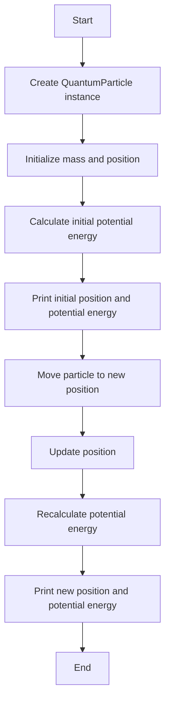

# Introduction to Classes in Python

In previous lessons, we have explored various fundamental concepts in Python such as variables and data types, lists, tuples, dictionaries, sets, and control flow statements like `for`, `if`, `elif`, `else`, and `while` loops. Now, we will take a step further and introduce you to the concept of **classes** in Python, which is a cornerstone of object-oriented programming (OOP).

## What is a Class?

A class is a blueprint for creating objects. An object is an instance of a class. Classes encapsulate data for the object and methods to manipulate that data. This allows for more modular and reusable code.

### Example: Physics Concepts

Let's consider a simple example from physics to illustrate the concept of classes. Suppose we want to model a **Particle** in physics. A particle has properties such as position, velocity, and mass. These properties can be represented as variables (attributes) within a class.

```python
class Particle:
    def __init__(self, position, velocity, mass):
        self.position = position  # List to store x, y, z coordinates
        self.velocity = velocity  # List to store velocity components
        self.mass = mass          # Float to store mass of the particle

    def move(self, time):
        # Update position based on velocity and time
        self.position[0] += self.velocity[0] * time
        self.position[1] += self.velocity[1] * time
        self.position[2] += self.velocity[2] * time

    def kinetic_energy(self):
        # Calculate kinetic energy: (1/2) * mass * velocity^2
        v_squared = sum(v**2 for v in self.velocity)
        return 0.5 * self.mass * v_squared
```

### Connecting with Previous Topics

- **Variables and Data Types**: The attributes `position`, `velocity`, and `mass` are variables of different data types (list and float).
- **Lists**: We use lists to store the position and velocity components.
- **Control Flow**: Methods within the class can use control flow statements to perform operations. For example, the `move` method updates the position based on the velocity and time.
- **Functions**: Methods in a class are essentially functions that operate on the object's data.

By understanding classes, you will be able to create more complex and organized programs. Classes allow you to model real-world entities and their interactions in a more intuitive way.

In the next lessons, we will delve deeper into object-oriented programming concepts such as inheritance, polymorphism, and encapsulation, which will further enhance your ability to write efficient and maintainable code.
## Detailed Explanation of Example 1

Let's break down the `Particle` class example line by line to understand its structure and functionality.

```python
class Particle:
```
- This line defines a new class named `Particle`.

```python
    def __init__(self, position, velocity, mass):
```
- The `__init__` method is a special method called a constructor. It is automatically called when a new instance of the class is created. It initializes the object's attributes.

```python
        self.position = position  # List to store x, y, z coordinates
        self.velocity = velocity  # List to store velocity components
        self.mass = mass          # Float to store mass of the particle
```
- These lines assign the values of `position`, `velocity`, and `mass` to the instance variables `self.position`, `self.velocity`, and `self.mass`, respectively. The `self` keyword refers to the instance of the class.

```python
    def move(self, time):
```
- This line defines a method named `move` that takes `time` as a parameter. This method will update the particle's position based on its velocity and the given time.

```python
        self.position[0] += self.velocity[0] * time
        self.position[1] += self.velocity[1] * time
        self.position[2] += self.velocity[2] * time
```
- These lines update the `position` of the particle by adding the product of `velocity` and `time` to each coordinate (x, y, z).

```python
    def kinetic_energy(self):
```
- This line defines a method named `kinetic_energy` that calculates and returns the kinetic energy of the particle.

```python
        v_squared = sum(v**2 for v in self.velocity)
```
- This line calculates the sum of the squares of the velocity components.

```python
        return 0.5 * self.mass * v_squared
```
- This line calculates and returns the kinetic energy using the formula $` \frac{1}{2} \times \text{mass} \times \text{velocity}^2 `$.
### Instance of a Class

An instance of a class is a specific object created from that class blueprint. When you create an instance, you are essentially creating a unique object with its own set of attributes and methods defined by the class. For example, if you create two instances of the `Particle` class, each instance will have its own `position`, `velocity`, and `mass` attributes.

```python
# Creating two instances of the Particle class
particle1 = Particle([0, 0, 0], [1, 1, 1], 1.0)
particle2 = Particle([10, 10, 10], [0, -1, 0], 2.0)

# Each instance has its own attributes
print(particle1.position)  # Output: [0, 0, 0]
print(particle2.position)  # Output: [10, 10, 10]
```

In this example, `particle1` and `particle2` are two different instances of the `Particle` class, each with its own state. This demonstrates how classes can be used to create multiple objects with similar structures but different data.

By understanding each line of this example, you can see how classes encapsulate data and behavior, making your code more modular and reusable.

## Functions vs Classes in Python

In Python, both functions and classes are fundamental building blocks that help in organizing and structuring code. However, they serve different purposes and have distinct structures.

### Functions

A function is a block of reusable code that performs a specific task. Functions help in breaking down complex problems into smaller, manageable pieces. They can take inputs (parameters), perform operations, and return outputs.

#### Structure of a Function

```python
def function_name(parameters):
    """
    Docstring: A brief description of what the function does.
    """
    # Function body
    # Perform operations
    return result
```

- **Function Definition**: The `def` keyword is used to define a function.
- **Function Name**: A unique name that identifies the function.
- **Parameters**: Optional inputs that the function can accept.
- **Docstring**: An optional string that describes the function's purpose.
- **Function Body**: The block of code that performs the function's operations.
- **Return Statement**: The output that the function returns.

#### Example of a Function

```python
def add(a, b):
    """
    This function takes two numbers and returns their sum.
    """
    return a + b

# Using the function
result = add(3, 5)
print(result)  # Output: 8
```

### Classes

A class is a blueprint for creating objects. It encapsulates data (attributes) and methods (functions) that operate on that data. Classes are the foundation of object-oriented programming (OOP) in Python.

#### Structure of a Class

```python
class ClassName:
    """
    Docstring: A brief description of what the class represents.
    """
    
    def __init__(self, parameters):
        # Constructor method to initialize the object's attributes
        self.attribute = value
    
    def method_name(self, parameters):
        """
        Docstring: A brief description of what the method does.
        """
        # Method body
        # Perform operations
        return result
```

- **Class Definition**: The `class` keyword is used to define a class.
- **Class Name**: A unique name that identifies the class.
- **Docstring**: An optional string that describes the class's purpose.
- **Constructor Method**: The `__init__` method initializes the object's attributes.
- **Attributes**: Variables that store the object's data.
- **Methods**: Functions defined within the class that operate on the object's data.

#### Example of a Class

```python
class Rectangle:
    """
    This class represents a rectangle with width and height.
    """
    
    def __init__(self, width, height):
        self.width = width
        self.height = height
    
    def area(self):
        """
        This method calculates the area of the rectangle.
        """
        return self.width * self.height

# Creating an instance of the Rectangle class
rect = Rectangle(4, 5)
print(rect.area())  # Output: 20
### Detailed Explanation of the Rectangle Class
```
Let's break down the `Rectangle` class example line by line to understand its structure and functionality.

```python
class Rectangle:
    """
    This class represents a rectangle with width and height.
    """
```
- This line defines a new class named `Rectangle` and includes a docstring that describes the class.

```python
    def __init__(self, width, height):
        self.width = width
        self.height = height
```
- The `__init__` method is a special method called a constructor. It is automatically called when a new instance of the class is created. It initializes the object's attributes `width` and `height`.

```python
    def area(self):
        """
            This method calculates the area of the rectangle.
            """
            return self.width * self.height

```
> ### Frequently Asked Question

> **Q: Why is `self.width * self.height` used in the `area` method instead of using `width * height` initialized in the constructor?**

> **A:** In the `area` method, `self.width` and `self.height` are used to refer to the instance variables of the object. When the constructor initializes the object, it assigns the values of `width` and `height` to `self.width` and `self.height`. Using `self.width` and `self.height` ensures that the method accesses the correct values associated with the specific instance of the class. If we used `width` and `height` directly, it would refer to the parameters passed to the constructor, which are not accessible outside the constructor.

- This line defines a method named `area` that calculates and returns the area of the rectangle using the formula `width * height`.

### Instance of the Rectangle Class

An instance of a class is a specific object created from that class blueprint. When you create an instance, you are essentially creating a unique object with its own set of attributes and methods defined by the class. For example:

```python
# Creating an instance of the Rectangle class
rect = Rectangle(4, 5)
print(rect.area())  # Output: 20
```

In this example, `rect` is an instance of the `Rectangle` class with `width` 4 and `height` 5. The `area` method calculates the area of the rectangle, which is 20.

By understanding each line of this example, you can see how classes encapsulate data and behavior, making your code more modular and reusable.

### When to Use Functions vs Classes

- **Functions**:
  - Use functions when you need to perform a specific task or calculation.
  - Functions are suitable for operations that do not require maintaining a state.
  - They are ideal for modularizing code and promoting code reuse.

- **Classes**:
  - Use classes when you need to model real-world entities with attributes and behaviors.
  - Classes are suitable for operations that require maintaining a state.
  - They are ideal for creating complex data structures and implementing OOP principles like inheritance and polymorphism.

By understanding the differences between functions and classes, you can choose the appropriate tool for organizing and structuring your code effectively.


> *In our Pythonia land, there was a wise old programmer named Guido. Guido loved creating things, but he found that his creations were often too complex and difficult to manage. One day, while pondering a solution, he had an epiphany: what if he could create blueprints for his creations? These blueprints would allow him to build multiple objects with similar structures but different details. And thus, the concept of **classes** was born.*

>*In Pythonia, there were many different creatures, but one of the most fascinating was the **Robot**. Robots had various attributes like `name`, `color`, and `battery_level`, and they could perform actions like `speak` and `charge`. Guido decided to create a class to represent these robots.*

```python
class Robot:
    def __init__(self, name, color, battery_level):
        self.name = name
        self.color = color
        self.battery_level = battery_level

    def speak(self):
        return f"Hello, I am {self.name}!"

    def charge(self):
        self.battery_level = 100
        return f"{self.name} is now fully charged!"
```

>*With this blueprint, Guido could now create as many robots as he wanted, each with its own unique attributes.*

```python
# Creating instances of the Robot class
robot1 = Robot("Robo", "red", 50)
robot2 = Robot("Mecha", "blue", 75)

# Each robot can perform actions
print(robot1.speak())  # Output: Hello, I am Robo!
print(robot2.charge())  # Output: Mecha is now fully charged!
```

>*The robots in Pythonia were happy and efficient, thanks to Guido's brilliant idea. They could now be created, customized, and controlled with ease. The concept of classes allowed Guido to organize his code better and reuse it whenever needed.*

>*As the days passed, Guido continued to refine his blueprints, adding more features and capabilities. He introduced concepts like inheritance, where one class could inherit attributes and methods from another, and polymorphism, where different classes could be used interchangeably.*

>*The land of Pythonia flourished with creativity and innovation, all thanks to the power of classes. And so, the story of the Python class became a legend, inspiring programmers everywhere to write clean, modular, and reusable code.*

>*And they coded happily ever after.*

## Quantum Physics Problem: Modeling a Quantum Particle in a Potential Well

In this problem, we will model a quantum particle in a one-dimensional potential well using a class in Python. The potential well is a fundamental concept in quantum mechanics, where a particle is confined within a region of space with potential energy barriers on either side.

### Problem Statement

We want to create a class `QuantumParticle` that models a quantum particle in a potential well. The class should have the following attributes and methods:

- **Attributes**:
    - `mass`: The mass of the particle.
    - `position`: The position of the particle in the potential well.
    - `potential_energy`: The potential energy of the particle at its current position.

- **Methods**:
    - `__init__(self, mass, position)`: Initializes the particle with a given mass and position.
    - `calculate_potential_energy(self)`: Calculates the potential energy of the particle based on its position.
    - `move(self, new_position)`: Updates the position of the particle and recalculates its potential energy.

### Solution

Let's implement the `QuantumParticle` class in Python:

```python
class QuantumParticle:
        def __init__(self, mass, position):
                self.mass = mass
                self.position = position
                self.potential_energy = self.calculate_potential_energy()

        def calculate_potential_energy(self):
                # Assuming a simple harmonic potential well: V(x) = 0.5 * k * x^2
                k = 1.0  # Spring constant
                return 0.5 * k * self.position**2

        def move(self, new_position):
                self.position = new_position
                self.potential_energy = self.calculate_potential_energy()

# Example usage
particle = QuantumParticle(mass=1.0, position=0.0)
print(f"Initial Position: {particle.position}, Potential Energy: {particle.potential_energy}")

# Move the particle to a new position
particle.move(2.0)
print(f"New Position: {particle.position}, Potential Energy: {particle.potential_energy}")
```

### Detailed Explanation

1. **Class Definition**:
     - We define a class `QuantumParticle` to model the quantum particle.

2. **Constructor Method (`__init__`)**:
     - The constructor initializes the particle's mass and position.
     - It also calculates the initial potential energy using the `calculate_potential_energy` method.

3. **Calculate Potential Energy Method (`calculate_potential_energy`)**:
     - This method calculates the potential energy of the particle based on its position.
     - We assume a simple harmonic potential well with the formula: $` V(x) = 0.5 \times k \times x^2 `$
    where $k$ is the spring constant.

4. **Move Method (`move`)**:
     - This method updates the particle's position and recalculates its potential energy.

### Flowchart

Below is a flowchart that explains the flow of the solution:



By following this approach, we can model a quantum particle in a potential well and simulate its behavior using object-oriented programming in Python. This example demonstrates how classes can be used to encapsulate data and behavior, making the code more modular and reusable.